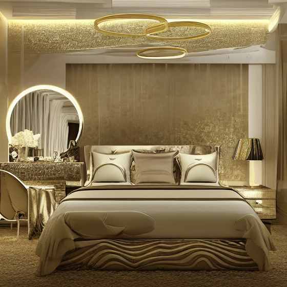
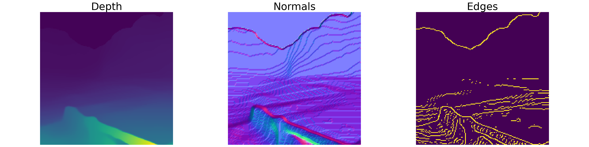

# ControlledStableDiffusion(CSD)
This repository contains the solutions for Avataar.AI assignment. 


## Repository Structure
    
	.
	├── depth_images                   # Folder containing the depth images used to control the generation process of stable diffusion   
	├── generated_images               # Folder containing the generated images
	├── main.py                        # File containing code for the image generation pipeline
	├── main_self.py                   # File containing code for denosing loop, implemented for self-learning
	└── utils.py                       # File containing helper functions

## Environment Settings

- python: 3.9.1
- pyTorch: 2.0.1
- diffusers: 0.29.2
- pillow: 9.4.0
- numpy: 1.25.0
- openCV: 4.10.0
- scikit-image: 0.24.0


## Arguments discription of main.py

		--seed: Sets the seed for random number generation to ensure reproducibility of results.
		--use_cuda: If specified, the program will utilize GPU acceleration for computations.
		--prompt: The text prompt to guide the image generation process.
		--num_inference_steps: Specifies the number of inference steps to be used in the generation process.
		--height: Sets the height of the generated image in pixels.
		--width: Sets the width of the generated image in pixels.
		--beta_start: The starting value of the beta parameter for the noise schedule in the diffusion process.
		--beta_end: The ending value of the beta parameter for the noise schedule in the diffusion process.
		--control_guidance_start: The starting value for control guidance strength.
		--control_guidance_end: The ending value for control guidance strength.
		--controlnet_con_scale: Scale factors for control net contribution, allowing multiple values for multiple ControlNet inputs.
		--guidance_scale: The scale of guidance used in the generation process to steer the output towards the prompt.
		--scheduler: Specifies the type of scheduler to use for the generation process.
		--input_img_pth: The file path of the input image to be used in the generation process.
		--generated_img_pth: The file path where the generated image will be saved.
		--control_with_depth: If specified, the generation process will be controlled using a depth image.
		--control_with_canny: If specified, the generation process will be controlled using Canny edge detection.
		--control_with_normals: If specified, the generation process will be controlled using surface normal information.
		--control_with_segment: If specified, the generation process will be controlled using segmentation information.
		--use_f16: If specified, the program will use 16-bit floating point precision for faster computation.
  		--use_resizing : If specified, the ControlNet input images will be resized to 512x512.
    	--use_xFormers : If specified, model will use xFormers acceleration and token merging.


## Readme file Structure

Here, I present a thorough analysis of the findings from the given assignment. The document is divided into five sections: 

1. Detailed walkthrough of the main.py code.
2. Impact of different inputs to ControlNet and various scheduler algorithms on image generation quality.
3. Analysis of generating images with different aspect ratios and their quality.
4. Factors affecting inference time, including hardware and algorithmic complexity.
5. Showcase of all generated images, detailing unique challenges and solutions.

# Assignment Analysis

This document presents a thorough analysis of the findings from the given assignment. It is divided into the following sections:

## 1. Detailed Walkthrough of main.py Code
An in-depth explanation of the main.py code, including its structure, functions, and overall purpose.

After importing Required Libraries and Setting Up Model Arguments

### Main Function: `generate_an_image`
This function contains the pipeline for generating images using Stable Diffusion with ControlNet.

#### Floating Point Precision and Device Setup
We determine the floating point precision and the computation device (CPU/GPU) to be used:
```python
if args.use_f16:
    dtype_to_be_used =  torch.float16
else:
    dtype_to_be_used =  torch.float32

if args.use_cuda:
    torch_device = torch.device("cuda")
```

#### Loading ControlNet Models
Depending on the specified control type (depth, canny, normals, segment), appropriate ControlNet models are loaded:
```python
all_control_nets = []
if args.control_with_depth:
    controlnet = ControlNetModel.from_pretrained("lllyasviel/sd-controlnet-depth", torch_dtype=dtype_to_be_used)
    controlnet.to(torch_device)
    all_control_nets.append(controlnet)
# ... (other controls)
```

#### Loading Stable Diffusion ControlNet Pipeline
We load the Stable Diffusion pipeline with the specified ControlNet models:
```python
pipeline = StableDiffusionControlNetPipeline.from_pretrained("runwayml/stable-diffusion-v1-5", controlnet=controlnet, torch_dtype=dtype_to_be_used)
```

#### Scheduler Setup
The scheduler (denoising algorithm) for the image generation process is chosen based on user input:
```python
if args.scheduler == "DDIM":
    pipeline.scheduler = DDIMScheduler.from_config(pipeline.scheduler.config)
# ... (other schedulers)
```

#### Enabling Efficiency Optimizations
We enable xFormers acceleration and token merging if specified for faster computation:
```python
if args.use_xFormers:
    pipeline.enable_xformers_memory_efficient_attention()
    tomesd.apply_patch(pipeline, ratio=0.5)
```
Additionally, we offload parts of the model to the CPU to optimize memory usage:
```python
pipeline.enable_model_cpu_offload()
```

#### Preparing ControlNet Input Images
We convert the depth array to the required images for input to ControlNet and resize them if necessary:
```python
all_img_for_controlnet = []
if args.control_with_depth:
    image_for_controlnet = convert_to_depth(depth_arr)
    all_img_for_controlnet.append(image_for_controlnet)
# ... (other controls)
```
Check if the image size is appropriate, otherwise resize it to 512x512 for better generation quality:
```python
is_img_good_to_go = 1000 > ori_height > 500 and 1000 > ori_width > 500
if not is_img_good_to_go and args.use_resizing:
    if isinstance(image_for_controlnet, list):
        image_for_controlnet = [i_img.resize((512, 512), resample=PIL.Image.Resampling.LANCZOS) for i_img in image_for_controlnet]
    else:
        image_for_controlnet = image_for_controlnet.resize((512, 512), resample=PIL.Image.Resampling.LANCZOS)
```

#### Generating the Image
We generate the image using the Stable Diffusion and ControlNet pipeline:
```python
prompt =  args.prompt 
generator = torch.manual_seed(args.seed)
start_time = time.time()
generated_images = pipeline(prompt, height=args.height, width=args.width, image=image_for_controlnet, num_inference_steps=args.num_inference_steps, generator=generator, controlnet_conditioning_scale=args.controlnet_con_scale, guidance_scale=args.guidance_scale, safety_checker=None)
end_time = time.time()
duration = end_time - start_time
print(f"###Time taken for the task: {duration} seconds")
```

#### Saving the Generated Image
Finally, we save the generated image to the specified path:
```python
generated_image = generated_images.images[0]
if not is_img_good_to_go and args.use_resizing:
    generated_image = generated_image.resize((ori_height, ori_width), resample=PIL.Image.Resampling.LANCZOS)
generated_image.save(args.generated_img_pth)
```

### Main Execution
The main execution block parses arguments, sets the seed, and calls the image generation function:
```python
if __name__ == '__main__':
    args = parse_args()
    set_seed(args.seed)
    generated_img = generate_an_image(args)
```

This walkthrough should give you a comprehensive understanding of the key sections of the code and how they work together to generate images using Stable Diffusion with ControlNet.


## 3. Aspect Ratio Analysis
Analysis of methods to generate images with different aspect ratios and the corresponding impact on image quality.

## 4. Inference Time Study
Investigation into the factors that affect inference time, including hardware considerations and algorithmic complexity.

## 5. Generated Images and Challenges
A showcase of all generated images, detailing the unique challenges encountered for each image and the solutions implemented to overcome these challenges.

## 2. Impact on Image Generation Quality
Examination of how different inputs to ControlNet and various scheduler algorithms affect the quality of the generated images. In this section all studies were carried out using Image "2.png".

To generate image using only depth information using LMSDiscreteScheduler and 16-bit floating point precision:

 ```
python main.py --use_cuda --prompt "luxury bedroom interior" --input_img_pth "./depth_images/2.png" --generated_img_pth "./generated_images/2_depth.png" --control_with_depth --num_inference_steps 10  --use_f16
```
Depth map input for Control Net:


Generated Image


 To generate image using only canny edge information using LMSDiscreteScheduler and 16-bit floating point precision:

 ```
python main.py --use_cuda --prompt "luxury bedroom interior" --input_img_pth "./depth_images/2.png" --generated_img_pth "./generated_images/2_canny.png" --control_with_canny --num_inference_steps 10  --use_f16
```
Edges input for Control Net:


Generated Image


 To generate image using only surface normals information using LMSDiscreteScheduler and 16-bit floating point precision:

 ```
python main.py --use_cuda --prompt "luxury bedroom interior" --input_img_pth "./depth_images/2.png" --generated_img_pth "./generated_images/2_normal.png" --control_with_normal --num_inference_steps 10  --use_f16
```
Surface Normals input for Control Net:


Generated Image


 To generate image using only segment information using LMSDiscreteScheduler and 16-bit floating point precision:

 ```
python main.py --use_cuda --prompt "luxury bedroom interior" --input_img_pth "./depth_images/2.png" --generated_img_pth "./generated_images/2_segment.png" --control_with_segment --num_inference_steps 10  --use_f16
```

Segment image input for Control Net:


Generated Image


I found that images generated from depth input are richer in texture compared to those from other inputs. However, they lack the solid boundaries around objects that are more defined in images generated using edges and surface normal information.

When a high-threshold edge image is used, the generated output has finer structures, evident in the detailed quality of textures of carpet in second image. Using surface normal information enhances the clarity of boundaries between connected objects. Conversely, segmentation information yields the worst results, as it struggles to differentiate objects from a depth image.


### Best generated image

I found that the best image quality is achieved when using depth and surface normal information with a conditioning scale of 1.0 and 0.5, respectively, along with the LMSDiscreteScheduler.

1. with 50 inference steps:
inference time = 8.596s

 ```
python main.py --use_cuda --prompt "luxury bedroom interior" --input_img_pth "./depth_images/2.png" --generated_img_pth "./generated_images/2_depth_n_normal_50.png" --control_with_depth control_with_normal  --controlnet_con_scale 1.0 0.5 --num_inference_steps 50  --use_f16
```


2. With 10 inference steps:
inference time = 3.319s
 ```
python main.py --use_cuda --prompt "luxury bedroom interior" --input_img_pth "./depth_images/2.png" --generated_img_pth "./generated_images/2_depth_n_normal_10.png" --control_with_depth control_with_normal  --controlnet_con_scale 1.0 0.5 --num_inference_steps 10  --use_f16
```


I found that increasing the number of inference steps to 50 allows the model to generate images with more texture. However, given the increased inference time, I would argue that using 10 inference steps is more practical for real-world applications. This approach reduces inference time by over 60% while maintaining comparable image quality.

For comparison, the images generated using other combinations are shown below (all with --controlnet_con_scale 1.0 0.5, --num_inference_steps 10, and --use_f16).

1. Depth and Canny
   


2. Depth and Segment
   


3. Depth, Normal and Canny:


The study of impact of Various Scheduler (dinosier) and 16/32-but floating point precision are discussed in last section.


## Generating images of different aspect ration
For this purpose "./depth_images/2_nocrop.png" is used as mentioned in the assignment (all images are genrated using depth information and normal surface information with conditioning scale of 1.0 and 0.5 respectively and 10 inference steps LMSDiscreteScheduler)

1. Generating image with original aspect ratio with 32-bit floating point precision:
Inference Time:  8.313s


2. Generating image with original aspect ratio with 16-bit floating point precision:
Inference Time:  3.981s


2. Generating 1:1 aspect ratio with 16-bit floating point precision:
Inference Time:   3.156s


## Inference time
I found that the easiest way to reduce inference time is by using 16-bit floating-point precision instead of 32-bit. Additionally, selecting the right scheduler is crucial for optimizing inference time.

1. Impact of 16-bit vs 32-bit inference time (all images are generated using LMSDiscreteScheduler on depth and normal surface information with conditioning scale of 1.0 and 0.5 respectively, and 10 inference steps):
   
a. 32 bit
Inference Time: 7.063s


b. 16 bit
Inference Time: 3.320s


2. Impact of various schuduler on inference time and generation quality (all images are generated with depth and normal surface information with conditioning scale of 1.0 and 0.5 respectively):

a. PNDMScheduler: It accelerates diffusion model sampling by integrating pseudo numerical techniques, which balance between stability and speed, enhancing image generation quality.


b. DDIMScheduler: This scheduler offers deterministic and efficient sampling with fewer steps by leveraging implicit noise prediction, allowing for smoother and faster image synthesis in diffusion models.


c. DDPMScheduler: It follows the traditional probabilistic framework of diffusion models, providing robust and stable sampling but typically requires more inference steps for high-quality outputs.


d. LMSDiscreteScheduler: It uses linear multistep methods to solve the reverse diffusion process, achieving high-quality image generation with fewer inference steps, making it well-suited for use with ControlNet and Stable Diffusion.


e. HeunDiscreteScheduler: The Heun’s Method Scheduler applies Heun’s method, an improved Euler method, to the discrete diffusion process, offering enhanced accuracy and stability in image generation by correcting for potential errors at each step.


## Some more important findings:

1.  Negative prompting: We can also use negative prompts with Stable Diffusion. The model utilizes the embeddings from these negative prompts to discourage certain features described by them. For example, general negative prompts like “low resolution,” “worst quality,” or “low quality” can be used. This approach eliminates the need to specify detailed negative prompts for each input and does not impact inference time.
Without Negative Prompt:

 
 
With Negative Prompt:

 
 
2.  Image seeding: When setting a seed using the torch.Generator function on a CPU versus a GPU, the images generated with a CPU seed have better structure, such as more defined boundaries. This difference is mainly due to the fact that CPUs and GPUs use different implementations of Random Number Generators (RNGs).
   
With CPU seed:

 
 
With CUDA seed:

 
 
3.  Token merging: Token merging is beneficial for optimizing Stable Diffusion pipelines by reducing redundant tokens. However, it performs well only with larger image generation.
   
No token merging(below is the generated image of size 2048x2048):
Inference Time: 30.540s

 
 
With token merging:
Inference Time: 25.363s

 


#Other generated Images

1. Taking lower resolution images:
I found that model is having quite problem in generating images of low resolution such as 1.png, 3.png and 7.npy images and model can comfortably generate high quality images for resolution ranging from 500 to 100. So to tackle this challenge I explictly detect if input image is out of the mentioned range or not. If it is then I resize it to control net input image to 512x512 size and after generating the image,I will rsize it to it's original size. This method founds to bw quite simple and effective.

a. Image "1.png":

Inputs:




Generated Images:
(i) With original resolution:
```
python main.py --use_cuda --prompt "beautiful landscape, mountains in the background" --input_img_pth "./depth_images/1.png" --generated_img_pth "./generated_images/.png" --control_with_depth control_with_normal  --controlnet_con_scale 1.0 0.5 --num_inference_steps 10  --use_f16
```


(ii) With resizing techique:
```
python main.py --use_cuda --prompt "beautiful landscape, mountains in the background" --input_img_pth "./depth_images/1.png" --generated_img_pth "./generated_images/1_depth_n_normal_ori.png).png" --control_with_depth control_with_normal  --controlnet_con_scale 1.0 0.5 --num_inference_steps 10  --use_f16 --use_resizing
```


b. Image "3.png":

Inputs:


Generated Images:
(i) With original resolution:
```
python main.py --use_cuda --prompt "Beautiful snowy mountains" --input_img_pth "./depth_images/3.png" --generated_img_pth "./generated_images/3_depth_n_normal_ori.png.png" --control_with_depth control_with_normal  --controlnet_con_scale 1.0 0.5 --num_inference_steps 10  --use_f16
```


(ii) With resizing techique:
```
python main.py --use_cuda --prompt "Beautiful snowy mountains" --input_img_pth "./depth_images/3.png" --generated_img_pth "./generated_images/3_depth_n_normal.png" --control_with_depth control_with_normal  --controlnet_con_scale 1.0 0.5 --num_inference_steps 10  --use_f16 --use_resizing
```


c. Image "7.npy":

Inputs:


Generated Images:
(i) With original resolution:
```
python main.py --use_cuda --prompt "House in the forest" --input_img_pth "./depth_images/7.npy" --generated_img_pth "./generated_images/7_depth_n_normal_ori.png" --control_with_depth control_with_normal  --controlnet_con_scale 1.0 0.5 --num_inference_steps 10  --use_f16
```


(ii) With resizing techique:
```
python main.py --use_cuda --prompt "House in the forest" --input_img_pth "./depth_images/7.npy" --generated_img_pth "./generated_images/7_depth_n_normal.png" --control_with_depth control_with_normal  --controlnet_con_scale 1.0 0.5 --num_inference_steps 10  --use_f16 --use_resizing
```


2. Handling images of high resolution:
Image "4.png" have a size of 2668x2668. which is quite large and requires more compuation power. So, I tackled this problem in two ways, 1) By resizing image to 512x512 size then generate image and resize back to it's original size as mentioned above. 2) I have used xFormers with token merging.

Input:


Generated Images:
(i) With xFormers with token merging:

```
python main.py --use_cuda --prompt "luxurious bedroom interior" --input_img_pth "./depth_images/4.png" --generated_img_pth "./generated_images/4_depth_n_normal_xFormers.png" --control_with_depth control_with_normal  --controlnet_con_scale 1.0 0.5 --num_inference_steps 10  --use_f16 --use_xFormers
```


(ii) With resizing techique:
```
python main.py --use_cuda --prompt "luxurious bedroom interior" --input_img_pth "./depth_images/4.png" --generated_img_pth "./generated_images/4_depth_n_normal.png" --control_with_depth  --num_inference_steps 10  --use_f16 --use_resizing
```


4. Tackling floating point image data of Image 6.npy
In Image 6.npy, the given array is 32-bit float point which could not be directly converted to the PIL image. So, I have normalized the array first then convert it to 8 bit intrger format.

Inputs:


Generated Images:
```
python main.py --use_cuda --prompt "room with chair" --input_img_pth "./depth_images/6.npy" --generated_img_pth "./generated_images/6_depth_n_normal.png" --control_with_depth control_with_normal  --controlnet_con_scale 1.0 0.5 --num_inference_steps 10  --use_f16 
```


4. Handling 3D depth image:
Image "5.png" is a 3D depth image whereas all other images are one dimenional of conations the same information in all three dimensions.

Inputs:


Generated Images with first dimnesion's information:
```
python main.py --use_cuda --prompt "walls with cupboard" --input_img_pth "./depth_images/5.png" --generated_img_pth "./generated_images/5_depth_n_normal.png" --control_with_depth control_with_normal  --controlnet_con_scale 1.0 0.5 --num_inference_steps 10  --use_f16 
```


Generated Images with all three dimnesion's information:

```
python main.py --use_cuda --prompt "walls with cupboard" --input_img_pth "./depth_images/5.png" --generated_img_pth "./generated_images/5_depth_n_normal_rgb.png" --control_with_depth control_with_normal  --controlnet_con_scale 1.0 0.5 --num_inference_steps 10  --use_f16 
```


 
